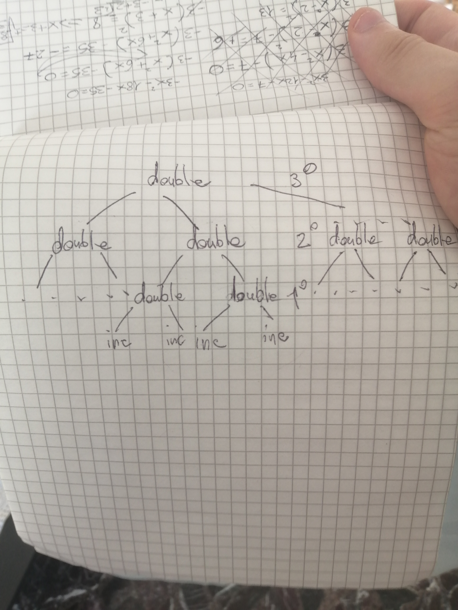

# 1.41


## Follow Up
This exercise requires to make up a procedure that returns a procedure as a value which when a procedure which accepts a number is applied it returns its value + 2

``` racket
(define (double doubling)
	(lambda (x) (+ (doubling x) 2))
)
```


Testing the procedure with some combination I get this error when I try to apply it:

+: contract violation  
  expected: number?  
  given: #<procedure>  

but (double (double double)) get evaluated to a procedure value, I try a little change just to be sure:

``` racket
(define (double doubling)
	(lambda (x) (doubling (+ x 2)))
)
```

## Solution
Still the same result, I guess the correctness of the procedure doesn't depend on which combination is first applied, so there must be a procedural mistake somewhere in the definition, I'll read the exercise again

yeah i get it, it's the procedure that is applied twice

``` racket
(define (double doubling)
	(lambda (x) (doubling (doubling x)))
)
```


When applied to 5 the combination gives 21, is it right?

``` racket
(define (inc x) (+ x 1))
```

--TEST

``` racket
(((double (double double)) inc) 5)->
```


I honestly have no idea why this is working, I have to dissect it at later time...

## Dissection

I make a function called compose defined by:

``` racket
(define (compose f g) (lambda (x) (f (g x))))
```

I define double as 
``` racket
(define (double f) (compose f f)) 
```

The I use this double function for readibility to solve the exercise:

``` racket
(((double (double double)) inc) 5)->

double-> (compose f f)

(double double)-> (compose (compose f f) (compose f f))
(double (double double))-> (compose (compose (compose f f) (compose f f)) (compose (compose f f) (compose f f)))
 ((compose (compose (compose inc inc) (compose inc inc)) (compose (compose inc inc) (compose inc inc)))
 
 (lambda (x) ((compose (compose inc inc) (compose inc inc)) ((compose (compose inc inc) (compose inc inc)) x)))
  ((compose (compose inc inc) (compose inc inc)) x))
  ((lambda (x) (compose inc inc) (compose inc inc)) x)
  
```

I cannot write the calls manually, but I think I have understood the nature of this composition by thinking of the tree structure and since it calls 3 times double in higher combinations, the increment level corresponds to 
  2^2*n where n is the number of double calls 


{ align=left }


This makes exercise 1.42 solved as well.