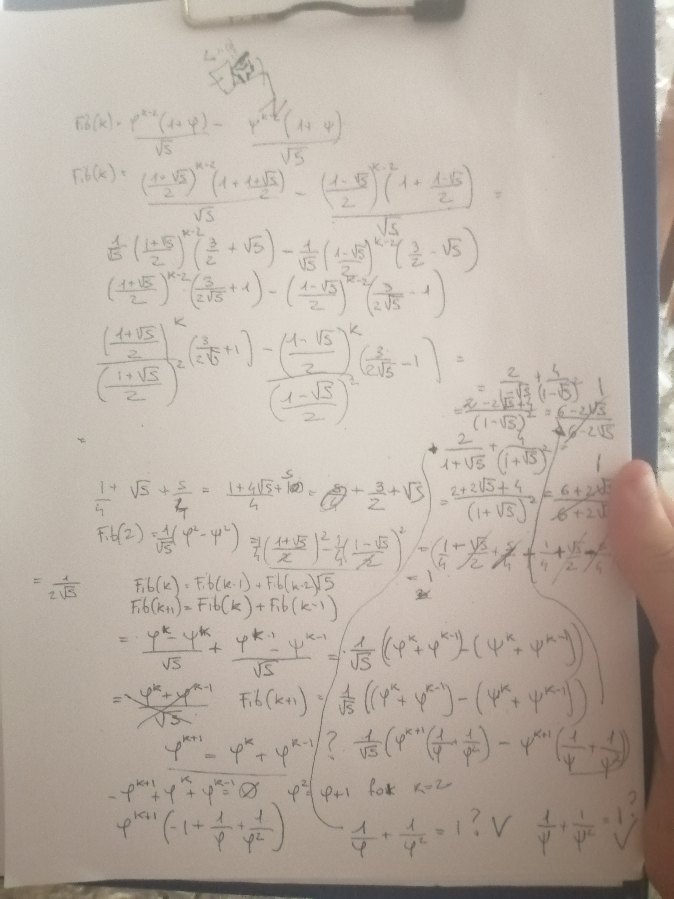

A pure math exercise.

if Fib(n) is the closest integer to phi^n/sqrt(5) and phi = (1 + sqrt(5))/2

the definition of Fib(n) is:
fib(n) = 0 if n = 0  
fib(n) = 1 if n = 1  
fib(n) = fib(n-1) + fib(n-2) if n > 1  

I have to prove that Fib(n) = (phi^n-psi^n)/sqrt(5)

{ align=left }
